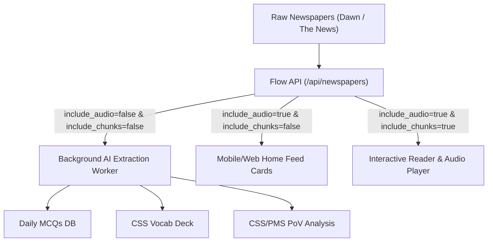

# Content Extraction Guide — From Raw Article to App Content

**Purpose:** Once the Flow API returns normalized articles (per the data acquisition spec), this guide defines how downstream AI pipelines ingest those articles to generate the three core CSS/PMS preparation content types:
1. **Daily MCQs (Current Affairs & General Knowledge)**
2. **High-Register Vocabulary (CSS Context & Nuances)**
3. **CSS/PMS Point-of-View (PoV Analysis & Essay Angles)**

---

## 1. Flow API Integration Modes

Depending on whether you are running bulk background AI ingestion or serving active user UI views, use the optimized query parameter profiles below:



### Profile A: Bulk AI Extraction Pipeline (Recommended)
> **Goal:** Maximum speed, minimal payload, zero audio/chunk processing overhead.

```bash
GET /api/newspapers?source=dawn&section=opinion&limit=10&include_audio=false&include_chunks=false&include_images=false
```
*Returns pure sanitized `body_text`, `author`, `title`, and `published_at` for prompt context.*

---

### Profile B: Feed / Card Listing View
> **Goal:** Lightweight thumbnail cards with instant "Listen" badges.

```bash
GET /api/newspapers?source=dawn&section=front-page&limit=10&include_audio=true&include_chunks=false&include_images=true
```
*Returns `image_url` and `audio_url` without the massive `audio_cues` array.*

---

### Profile C: Interactive Reader View (Listen-to-Article Player)
> **Goal:** Full article text with real-time word-by-word karaoke-style audio highlighting.

```bash
GET /api/newspapers?source=dawn&section=opinion&limit=1&include_audio=true&include_chunks=true&include_images=true
```
*Returns `audio_url` (.mp3) along with millisecond `audio_cues` for DOM tracking.*

---

## 2. Section-to-Content Routing Matrix

Not every newspaper article feeds every content type. Route articles to prompts by section:

| Section | Target Content Type | Why |
|---|---|---|
| **Opinion / Editorial** | **CSS Vocab** + **CSS/PMS Point-of-View** | Highest-register academic English, argumentative frameworks, constitutional & foreign policy arguments directly relevant to CSS Essay & Current Affairs papers. |
| **Front-Page / National** | **Daily MCQs** + **Current Affairs Facts** | High density of verifiable dates, names, institutional appointments, judicial orders, and official statistics. |
| **World** | **International Relations MCQs** + **PoV** | Geopolitics, treaties, multilateral diplomacy, and Middle East / South Asia regional shifts. |
| **Business** | **Economy MCQs** + **Financial Vocab** | Balance of payments, IMF tranches, monetary policy, energy tariffs, and economic terminology. |

---

## 3. Module 1: Daily MCQs Extraction

### Objective
Extract factual, exam-grade multiple-choice questions for CSS, PMS, and PPSC General Knowledge tests.

### Extraction Rules
- Focus on concrete facts: Supreme Court rulings, committee names, treaties, deadlines, geographic locations, and state appointments.
- Avoid vague or trivial questions.
- Provide 4 distinct options with exactly one correct answer and an explanatory note citing the article context.

### JSON Output Schema
```json
{
  "mcqs": [
    {
      "id": "mcq_001",
      "question": "Which medical facility was ordered by the Supreme Court of Pakistan to constitute a multidisciplinary medical board for incarcerated former PM Imran Khan in August 2026?",
      "options": [
        "Pakistan Institute of Medical Sciences (PIMS)",
        "Shifa International Hospital",
        "Aga Khan University Hospital",
        "Services Hospital Lahore"
      ],
      "correct_index": 1,
      "explanation": "A 3-member SC bench headed by Justice Shahid Waheed directed the government to shift Imran Khan to Shifa International Hospital within 48 hours.",
      "category": "Pakistan Affairs / Judiciary",
      "difficulty": "medium"
    }
  ]
}
```

---

## 4. Module 2: CSS Vocabulary Extraction

### Objective
Extract high-register, academic words and idiomatic expressions crucial for CSS English Précis & Composition and Essay writing.

### Extraction Rules
- Select words that enhance academic writing (e.g., *lacuna*, *indictment*, *devolution*, *disenfranchise*, *contrapuntal*).
- Define the word specifically in its CSS contextual usage.
- Provide synonyms, antonyms, and an exemplar sentence suited for an official policy or essay argument.

### JSON Output Schema
```json
{
  "vocab": [
    {
      "word": "lacuna",
      "phonetic": "/ləˈkjuːnə/",
      "part_of_speech": "noun",
      "css_meaning": "An unfilled space, gap, or missing portion in a law, treaty, or constitution.",
      "synonyms": ["hiatus", "omission", "crevice", "deficiency"],
      "antonyms": ["completeness", "closure", "abundance"],
      "context_in_article": "On account of the lacuna — still awaiting correction — in the 26th and 27th Amendments, a situation arose which could be described as chaotic.",
      "css_usage_example": "Constitutional experts argue that existing statutory lacunae undermine judicial independence."
    }
  ]
}
```

---

## 5. Module 3: CSS/PMS Point-of-View (PoV) Analysis

### Objective
Distill complex editorial arguments into structured outlines that CSS candidates can directly memorize and deploy in Essay, International Relations, and Current Affairs papers.

### Extraction Structure
1. **Central Thesis:** The core stance taken by the author.
2. **Context & Catalysts:** What policy, event, or constitutional development sparked this debate.
3. **Core Arguments (Points):** 3–5 well-reasoned arguments with historical or statutory backing.
4. **Counter-Arguments / Critical Lens:** Opposing viewpoints or inherent flaws in the plan.
5. **Way Forward (Recommendations):** Actionable policy steps for governance reform.
6. **Relevant CSS Papers:** Specific syllabus papers this topic maps to.

### JSON Output Schema
```json
{
  "pov_analysis": {
    "article_title": "Winds of change to where?",
    "author": "Zahid Hussain",
    "theme": "Constitutional Governance & Federalism in Pakistan",
    "relevant_papers": [
      "CSS Essay",
      "CSS Pakistan Affairs",
      "CSS Political Science Paper II",
      "CSS Governance & Public Policies"
    ],
    "central_thesis": "Imposing top-down administrative restructuring and creating provinces through extra-constitutional means risks destabilizing the federation; true reform requires empowering local governments under the 18th Amendment.",
    "key_arguments": [
      "Patchwork restructuring cannot salvage a collapsed governance model without democratic legitimacy.",
      "Arbitrary division of existing provincial boundaries (e.g. Karachi or Balochistan) risks provoking violent regional backlash.",
      "The 18th Amendment's devolution mandate remains incomplete because provinces haven't transferred fiscal and administrative powers to local councils."
    ],
    "policy_recommendations": [
      "Enact a constitutional amendment making local government powers and regular elections mandatory.",
      "Build parliamentary consensus across all federating units rather than relying on executive ordinances."
    ]
  }
}
```

---

## 6. Complete Ingestion Workflow Summary

```text
Step 1: Automated Daily Trigger (05:00 AM PKT)
        │
Step 2: Fetch raw text from Flow API
        GET /api/newspapers?source=dawn&section=opinion&limit=10&include_audio=false&include_chunks=false
        │
Step 3: Route articles through AI prompts (MCQ / Vocab / PoV)
        │
Step 4: Store structured JSON in App Database
        │
Step 5: App UI queries lightweight feeds for cards or detailed reader view for playback
        GET /api/newspapers?source=dawn&section=opinion&limit=1&include_chunks=true
```
