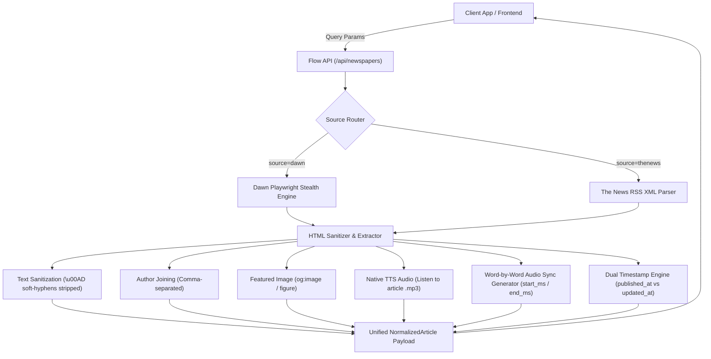

# Newspaper Data Acquisition & Audio Sync API Reference

Comprehensive reference manual for the Newspaper Acquisition, Listen-to-Article Audio, Word-by-Word Synchronization, and Content Extraction features in the Flow API.

---

## 1. Overview & Architecture

The Newspaper API provides a unified, normalized data ingestion pipeline for Pakistani English newspapers (Dawn & The News International). It is specifically engineered to power high-register CSS/PMS exam prep apps, current affairs trackers, and interactive audio reader interfaces.



---

## 2. API Endpoints

### 2.1 `GET /api/newspapers`
Query and acquire normalized daily articles from Dawn and The News.

**Example Request (Lightweight Card Feed):**
```bash
curl -X GET "http://localhost:5000/api/newspapers?source=dawn&section=opinion&limit=5&include_chunks=false"
```

**Example Request (Reader View with Synchronized Audio Cues):**
```bash
curl -X GET "http://localhost:5000/api/newspapers?source=dawn&section=opinion&limit=1&include_chunks=true"
```

---

### 2.2 `POST /api/newspapers`
Equivalent JSON body endpoint for programmatic backend integration.

**Example Request:**
```bash
curl -X POST "http://localhost:5000/api/newspapers" \
  -H "Content-Type: application/json" \
  -d '{
    "source": "dawn",
    "section": "front-page",
    "limit": 2,
    "include_audio": true,
    "include_chunks": true,
    "include_images": true
  }'
```

---

## 3. Query Parameters & Filtering

| Parameter | Type | Default | Description |
|---|---|---|---|
| `source` | `string` | `all` | Source newspaper: `all`, `dawn`, or `thenews`. |
| `section` | `string` | `opinion` | Section category: `front-page`, `opinion`, `editorial`, `world`, `business`, `pakistan`, `national`, `latest-news`, `epaper`, or `all`. |
| `date` | `string` | current date | Target publication date in `YYYY-MM-DD` format. |
| `limit` | `integer` | `10` | Maximum number of articles to return (range: `1` to `200`). |
| `full_body` | `boolean` | `true` | When `false`, returns fast listing teasers instead of scraping full article bodies. |
| `include_audio` | `boolean` | `true` | When `false`, omits the `audio_url` field. |
| `include_chunks` | `boolean` | `false` | When `true`, attaches `audio_cues` with millisecond timestamps for word-by-word active highlighting during audio playback. |
| `include_images` | `boolean` | `true` | When `false`, omits the `image_url` field. |

---

## 4. Response Schemas & Data Contracts

### 4.1 Root Response (`NewspaperApiResponse`)

```typescript
export interface NewspaperApiResponse {
  success: boolean;
  date: string;               // YYYY-MM-DD
  total: number;              // Total articles returned
  sources: {
    dawn?: NewspaperSourceStatus;
    thenews?: NewspaperSourceStatus;
  };
  section_counts?: Record<string, number>;
  articles: NormalizedArticle[];
  error?: string;
}
```

---

### 4.2 Article Object (`NormalizedArticle`)

```typescript
export interface NormalizedArticle {
  source: "dawn" | "thenews";
  section: string;
  title: string;
  url: string;
  image_url?: string | null;         // High-res image URL
  audio_url?: string | null;         // Direct MP3 stream for "Listen to article"
  audio_cues?: AudioSyncCue[];       // Word-by-word millisecond timestamps
  published_at: string;              // ISO 8601 UTC timestamp
  updated_at?: string | null;        // ISO 8601 UTC timestamp (when modified)
  scraped_at: string;                // ISO 8601 UTC timestamp of acquisition
  author: string | null;             // Comma-separated authors
  body_text: string;                 // Clean sanitized article content
  preview_url?: string;              // Link to original online article
  status: "fresh" | "stale" | "needs_review";
}
```

---

### 4.3 Audio Synchronization Cue (`AudioSyncCue`)

```typescript
export interface AudioSyncCue {
  id: number;       // 1-indexed sequential word/token ID
  text: string;     // The word or punctuation token
  start_ms: number; // Playback start time in milliseconds
  end_ms: number;   // Playback end time in milliseconds
}
```

---

## 5. Core Engine Features

### 5.1 Text Sanitization
- **Soft-Hyphen Removal:** Automatically purges invisible `\u00AD` soft hyphens inserted by news CMS engines for line breaking (e.g., `Su­p­reme Court` $\rightarrow$ `Supreme Court`).
- **Zero-Width Character Stripping:** Removes `\u200B-\u200D` and `\uFEFF` artifacts.
- **HTML Entity Decoding:** Normalizes smart quotes, em-dashes, and ampersands.

### 5.2 Multi-Author Disambiguation
- Disambiguates co-authors and joins them with clean comma delimiters (e.g., `"Ikram Junaidi, Nasir Iqbal"` instead of `"Ikram JunaidiNasir Iqbal"`).
- Scoped strictly to the article header byline (`.story__header .story__byline`) to prevent sidebar/footer contributor bleed.

### 5.3 "Listen to article" Native Audio Stream
- Directly extracts Dawn's native Text-to-Speech (TTS) stream (`<figure class="tts"><audio id="tts" src="...">`) into `audio_url`.
- Returns direct streaming `.mp3` links (e.g., `https://i.dawn.com/tts/2023832_1787098060.mp3`).

### 5.4 Word-by-Word Synchronized Highlighting
- Generates `audio_cues` containing millisecond-accurate start/end timestamps for every word in the article when `include_chunks=true` is requested.
- Enables frontend players to highlight text in real-time as the audio narrates.

### 5.5 Dual Timestamp Engine
- **`published_at`:** Extracts the exact CMS batch publishing time from `JSON-LD datePublished` / `article:published_time`. *(Dawn print editions are released in morning CMS batches at `04:40:34 AM PKT` / `23:40:34 UTC`).*
- **`updated_at`:** Captures live breaking updates and editorial revisions from `JSON-LD dateModified` and `<time class="timestamp--time timeago">`.

---

## 6. Frontend Integration Guide

### 6.1 Implementing Synchronized Word Highlighting (Web / Mobile)

```javascript
// React / Vanilla JS Example
const audioElement = document.getElementById("audio-player");

audioElement.ontimeupdate = () => {
  const currentMs = audioElement.currentTime * 1000;
  
  // Find current active word cue
  const activeCue = article.audio_cues.find(
    cue => currentMs >= cue.start_ms && currentMs <= cue.end_ms
  );

  if (activeCue) {
    // Highlight the active word DOM element
    document.querySelectorAll(".word-token").forEach(el => el.classList.remove("highlight"));
    const activeEl = document.getElementById(`word-${activeCue.id}`);
    if (activeEl) {
      activeEl.classList.add("highlight");
      activeEl.scrollIntoView({ behavior: "smooth", block: "center" });
    }
  }
};
```

---

## 7. Automated Test Suite

A comprehensive test suite is included to verify all query parameters against the live API.

```bash
# Run the query parameter test suite
npx tsx scripts/test-newspaper-query-params.ts
```

**Validated Scenarios (10/10 PASS):**
1. `include_chunks=false` payload size optimization
2. `include_chunks=true` audio cue array structure & timings
3. `include_images=false` omission
4. `include_images=true` extraction
5. `include_audio=false` omission
6. `include_audio=true` extraction
7. `full_body=false` teaser mode
8. `source=thenews` RSS ingestion
9. `limit=N` response clamping
10. `POST /api/newspapers` body parameter parity
